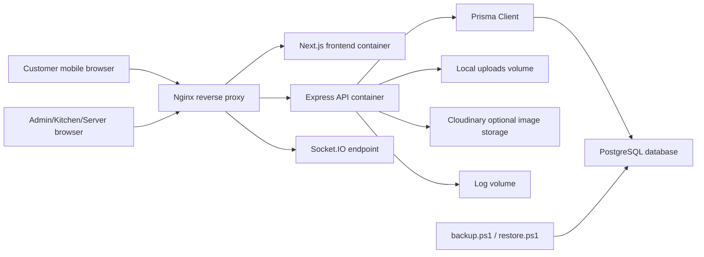
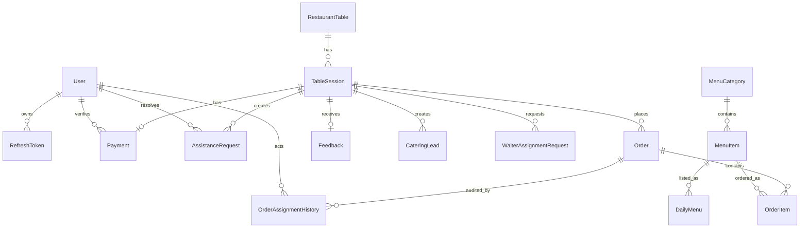
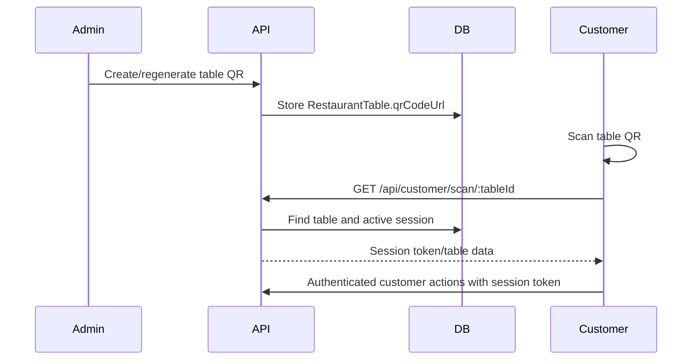
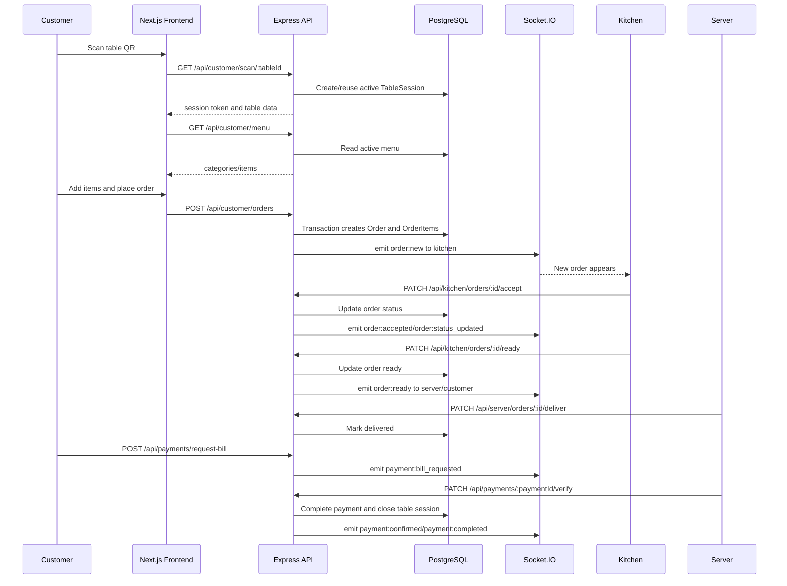
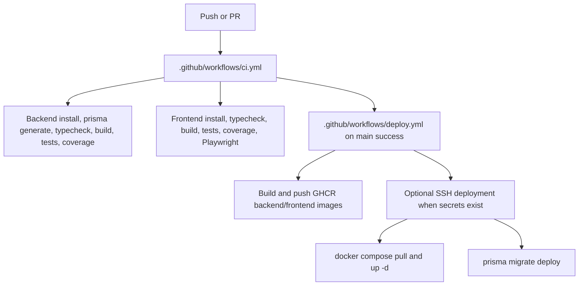

# Nati Nest Complete Technology and Implementation Analysis

Source of truth: this document is based on the repository source code under `backend/`, `frontend/`, `nginx/`, `.github/`, `scripts/`, `docker-compose.yml`, and the Prisma schema. It does not treat prompts, previous reports, or documentation as proof of implementation.

## 1. Executive Summary

Nati Nest is implemented as a production-oriented smart QR canteen management system with:

- A Node.js + Express + TypeScript backend in `backend/`.
- A PostgreSQL database accessed through Prisma in `backend/prisma/schema.prisma`.
- A Next.js 15 + React 19 frontend in `frontend/`.
- Real-time staff and customer updates through Socket.IO.
- QR based table session entry.
- Manual cash and UPI payment workflows with staff verification.
- Admin, kitchen, server/waiter, and customer experiences.
- Docker Compose deployment with backend, frontend, and Nginx services.
- CI/CD workflows, health checks, backup scripts, and operational documentation.

The system is not a payment-gateway product. It supports UPI QR display and cash/UPI payment confirmation/verification, but source code does not show Razorpay, Stripe, Cashfree, PhonePe, Paytm, webhook verification, gateway order IDs, refunds, or automated bank settlement.

## 2. Source Files Reviewed

Primary files and folders used for this analysis:

| Area | Evidence |
| --- | --- |
| Backend entrypoint | `backend/src/index.ts` |
| Backend routes | `backend/src/routes/*.ts` |
| Backend controllers | `backend/src/controllers/*.ts` |
| Backend services | `backend/src/services/*.ts` |
| Backend middlewares | `backend/src/middlewares/*.ts` |
| Backend sockets | `backend/src/sockets/*.ts` |
| Backend utilities | `backend/src/utils/*.ts` |
| Backend validators | `backend/src/validators/*.ts` |
| Database schema | `backend/prisma/schema.prisma` |
| Frontend App Router | `frontend/src/app/**/page.tsx`, `frontend/src/app/**/layout.tsx` |
| Frontend components | `frontend/src/components/**` |
| Frontend stores | `frontend/src/stores/*.ts` |
| Frontend API layer | `frontend/src/lib/api-client.ts`, `frontend/src/services/*.ts` |
| Frontend socket layer | `frontend/src/context/SocketContext.tsx`, `frontend/src/lib/socket-client.ts` |
| Docker | `docker-compose.yml`, `backend/Dockerfile`, `frontend/Dockerfile`, `nginx/nginx.conf` |
| CI/CD | `.github/workflows/ci.yml`, `.github/workflows/deploy.yml` |
| Backup/restore | `scripts/backup.ps1`, `scripts/restore.ps1` |

## 3. Technology Stack

| Layer | Technology | Version / Evidence | Purpose |
| --- | --- | --- | --- |
| Backend runtime | Node.js | `node:22-alpine` in `backend/Dockerfile` | Runs API service |
| Backend framework | Express | `express` in `backend/package.json` | REST API |
| Backend language | TypeScript | `typescript` in `backend/package.json` | Typed backend code |
| ORM | Prisma | `@prisma/client`, `prisma` in `backend/package.json` | Database models, queries, migrations |
| Database | PostgreSQL | `provider = "postgresql"` in `backend/prisma/schema.prisma` | Persistent data store |
| Realtime | Socket.IO | `socket.io` in `backend/package.json` | Live order/payment/session updates |
| Validation | Zod | `zod` in `backend/package.json` and validators | Request schema validation |
| Auth | JWT | `jsonwebtoken` in `backend/package.json` | Staff and customer session tokens |
| Password hashing | bcryptjs | `bcryptjs` in `backend/package.json` | Staff password hashes |
| Uploads | multer | `backend/src/middlewares/upload.ts` | In-memory multipart upload handling |
| Image hosting | Cloudinary | `backend/src/config/cloudinary.ts`, `backend/src/utils/cloudinary.utils.ts` | Optional image upload storage |
| QR generation | qrcode | `backend/src/utils/qrcode.util.ts`, `backend/src/services/settings.service.ts` | Table QR and UPI QR generation |
| Excel export | exceljs | `backend/src/utils/excel.util.ts` | Report/export workbook generation |
| Logging | Winston | `backend/src/config/logger.ts` | Structured backend logging |
| Security headers | Helmet | `backend/src/index.ts` | HTTP security headers and CSP |
| Rate limiting | express-rate-limit | `backend/src/middlewares/security.ts` | API/auth limits |
| Frontend framework | Next.js | `next` in `frontend/package.json` | App Router UI |
| Frontend runtime | React | `react`, `react-dom` in `frontend/package.json` | UI rendering |
| Frontend language | TypeScript | `typescript` in `frontend/package.json` | Typed UI code |
| Styling | Tailwind CSS | `tailwindcss` and `frontend/tailwind.config.ts` | Utility CSS and design tokens |
| Frontend state | Zustand | `frontend/src/stores/*.ts` | Auth, session, cart, dashboards |
| HTTP client | Axios | `frontend/src/lib/api-client.ts` | API requests and auth refresh |
| Frontend realtime | socket.io-client | `frontend/src/context/SocketContext.tsx` | Browser socket connection |
| QR scanning | jsQR | `frontend/src/components/customer/QRScanner.tsx` | Camera QR decoding |
| UI icons | lucide-react, Material Symbols | `frontend/src/components/**`, `frontend/src/app/globals.css` | Icon rendering |
| Testing | Vitest, Supertest, RTL, Playwright | `backend/package.json`, `frontend/package.json` | Unit/API/frontend/E2E testing |
| Reverse proxy | Nginx | `nginx/nginx.conf` | Frontend/API/socket routing |
| Containerization | Docker Compose | `docker-compose.yml` | Multi-service deployment |

## 4. High-Level Architecture

Backend startup is centralized in `backend/src/index.ts`. It builds the Express app, configures security middleware, mounts route modules, registers Socket.IO handlers, checks database readiness, and starts the HTTP server.

Frontend routing uses the Next.js App Router. Dashboard routes live under `frontend/src/app/(dashboards)/`, customer routes under `frontend/src/app/customer/`, and QR entry routes under `frontend/src/app/scan/[tableId]/` and `frontend/src/app/table/[tableId]/`.

## 5. Backend Architecture

The backend follows a route-controller-service pattern:

| Layer | Responsibility | Evidence |
| --- | --- | --- |
| Routes | URL registration, middleware composition | `backend/src/routes/*.ts` |
| Controllers | HTTP request/response handling | `backend/src/controllers/*.ts` |
| Services | Business logic and Prisma access | `backend/src/services/*.ts` |
| Validators | Zod schemas and request validation | `backend/src/validators/*.ts` |
| Middlewares | Auth, authorization, upload, security, errors | `backend/src/middlewares/*.ts` |
| Sockets | Socket authentication, rooms, real-time joins | `backend/src/sockets/*.ts` |
| Utils | JWT, QR, Excel, Cloudinary, notifications, logging helpers | `backend/src/utils/*.ts` |

Routes mounted in `backend/src/index.ts`:

| API prefix | Router file | Purpose |
| --- | --- | --- |
| `/api/auth` | `backend/src/routes/auth.routes.ts` | Login, refresh, logout, current user |
| `/api/catering` | `backend/src/routes/catering.routes.ts` | Catering lead/enquiry submission and admin management |
| `/api/categories` | `backend/src/routes/category.routes.ts` | Menu category CRUD |
| `/api/menu-items` | `backend/src/routes/menu.routes.ts` | Menu item CRUD |
| `/api/menu` | `backend/src/routes/menu.routes.ts` | Menu item CRUD alias/public menu |
| `/api/tables` | `backend/src/routes/table.routes.ts` | Table CRUD and QR generation |
| `/api/customer` | `backend/src/routes/customer.routes.ts` | QR scan/session/menu/assistance/bill |
| `/api/customer/orders` | `backend/src/routes/order.routes.ts` | Customer order placement, listing, details, cancel |
| `/api/kitchen` | `backend/src/routes/kitchen.routes.ts` | Kitchen order workflow |
| `/api/server` | `backend/src/routes/server.routes.ts` | Waiter/server delivery, assistance, assignments |
| `/api/payments` | `backend/src/routes/payment.routes.ts` | Bill request, tip, status, staff verification |
| `/api/settings` | `backend/src/routes/settings.routes.ts` | Admin settings, UPI QR, logo |
| `/api/staff` | `backend/src/routes/staff.routes.ts` | Staff CRUD and activation |
| `/api/feedback` | `backend/src/routes/feedback.routes.ts` | Customer feedback and admin list |
| `/api/reports` | `backend/src/routes/reports.routes.ts` | Dashboard and analytics reports |
| `/api/protected` | `backend/src/routes/protected.example.ts` | RBAC example routes |
| `/api/daily-menu` | `backend/src/routes/daily-menu.routes.ts` | Daily menu add/remove/restore/history |
| `/api/admin` | `backend/src/routes/admin.routes.ts` | Admin reassignment and force actions |

## 6. Frontend Architecture

The frontend is implemented with Next.js App Router and client-side state where needed.

| Area | Evidence | Purpose |
| --- | --- | --- |
| Root app shell | `frontend/src/app/layout.tsx`, `frontend/src/app/providers.tsx` | Global providers/styles |
| Staff login | `frontend/src/app/(auth)/login/page.tsx` | Staff authentication |
| Admin dashboard | `frontend/src/app/(dashboards)/admin/**` | Admin pages |
| Kitchen dashboard | `frontend/src/app/(dashboards)/kitchen/page.tsx`, `frontend/src/components/kitchen/**` | Kitchen Kanban board |
| Server dashboard | `frontend/src/app/(dashboards)/server/page.tsx`, `frontend/src/components/server/**` | Waiter/server operations |
| Customer flow | `frontend/src/app/customer/**`, `frontend/src/components/customer/**` | Menu, cart, tracking, bill, feedback, catering |
| QR entry | `frontend/src/app/scan/[tableId]/page.tsx`, `frontend/src/app/table/[tableId]/page.tsx` | Table session start |
| API client | `frontend/src/lib/api-client.ts` | Axios setup, token injection, staff refresh |
| Socket provider | `frontend/src/context/SocketContext.tsx` | Browser Socket.IO connection |
| Stores | `frontend/src/stores/*.ts` | Zustand state |
| Shared UI | `frontend/src/components/ui/**`, `frontend/src/components/common/**` | Buttons, inputs, cards, loaders, states |

Important frontend stores:

| Store | Evidence | Responsibility |
| --- | --- | --- |
| Auth | `frontend/src/stores/authStore.ts` | Staff token, refresh token, user, logout |
| Session | `frontend/src/stores/sessionStore.ts` | Customer session token/session/table |
| Cart | `frontend/src/stores/cartStore.ts` | Cart items, quantities, instructions, drawer state |
| Menu | `frontend/src/stores/menuStore.ts` | Admin menu state |
| Table | `frontend/src/stores/tableStore.ts` | Admin table state |
| Kitchen | `frontend/src/stores/kitchenStore.ts` | Kitchen orders and connection state |
| Server | `frontend/src/stores/serverStore.ts` | Ready orders, assistance, payments, assignments |
| Daily menu | `frontend/src/stores/dailyMenuStore.ts` | Today's menu and removed/history state |

## 7. Feature Implementation Map

| Feature | Status from source | Backend evidence | Frontend evidence |
| --- | --- | --- | --- |
| Staff login | Implemented | `backend/src/routes/auth.routes.ts`, `backend/src/services/auth.service.ts` | `frontend/src/app/(auth)/login/page.tsx`, `frontend/src/stores/authStore.ts` |
| Refresh token rotation/revocation | Implemented | `RefreshToken` model, `backend/src/services/auth.service.ts`, `/api/auth/refresh`, `/api/auth/logout` | `frontend/src/lib/api-client.ts`, `authStore.ts` |
| RBAC | Implemented | `backend/src/middlewares/authenticate.ts`, `authorize.ts`, route-level role checks | `AuthGuard.tsx`, dashboard layouts |
| QR table scan | Implemented | `backend/src/routes/customer.routes.ts`, `backend/src/services/session.service.ts` | `frontend/src/app/scan/[tableId]/page.tsx`, `frontend/src/components/customer/QRScanner.tsx` |
| Table CRUD and QR generation | Implemented | `backend/src/routes/table.routes.ts`, `table.service.ts`, `qrcode.util.ts` | `frontend/src/app/(dashboards)/admin/tables/page.tsx`, `frontend/src/components/admin/tables/**` |
| Menu categories | Implemented | `category.routes.ts`, `category.service.ts` | `frontend/src/components/admin/menu/CategoryList.tsx`, `CategoryForm.tsx` |
| Menu items | Implemented | `menu.routes.ts`, `menu.service.ts` | `frontend/src/components/admin/menu/MenuItemList.tsx`, `MenuItemForm.tsx` |
| Menu image upload | Implemented | `upload.ts`, `cloudinary.utils.ts`, `menu.routes.ts` | `ImageUpload.tsx`, `MenuItemForm.tsx` |
| Customer menu | Implemented | `customer.routes.ts`, `session.controller.ts` | `frontend/src/app/customer/menu/page.tsx`, `components/customer/menu/**` |
| Cart | Implemented | Order API consumes cart payload | `frontend/src/stores/cartStore.ts`, `CartDrawer.tsx`, `FloatingCartButton.tsx` |
| Order placement | Implemented | `order.routes.ts`, `order.controller.ts`, `order.service.ts`, `order.validators.ts` | `frontend/src/app/customer/menu/page.tsx`, `customerService.ts` |
| Order tracking | Implemented | Order status services and socket events | `frontend/src/app/customer/track/page.tsx`, `components/customer/tracking/**` |
| Kitchen board | Implemented | `kitchen.routes.ts`, `kitchen.service.ts` | `KitchenBoard.tsx`, `KitchenColumn.tsx`, `components/kitchen/**` |
| Server/waiter board | Implemented | `server.routes.ts`, `server.service.ts` | `ServerBoard.tsx`, `components/server/**` |
| Bill request | Implemented | `payment.routes.ts`, `payment.service.ts`, `customer.routes.ts` | `frontend/src/app/customer/bill/page.tsx`, server payment panels |
| Cash payment flow | Implemented as manual confirmation/verification | `PaymentMethod.CASH`, `payment.service.ts` | `CashPaymentConfirmation.tsx`, `PaymentVerificationModal.tsx` |
| UPI QR payment flow | Implemented as QR display and manual verification | `settings.routes.ts`, `settings.service.ts`, `payment.service.ts` | `UpiPaymentDisplay.tsx`, `PaymentMethodSelector.tsx` |
| Gateway payments | Not implemented | No gateway SDK/webhook/payment ID schema fields | No gateway checkout component |
| Feedback | Implemented | `feedback.routes.ts`, `feedback.service.ts` | `frontend/src/app/customer/feedback/page.tsx`, `feedback/**` |
| Admin reports | Implemented | `reports.routes.ts`, `reports.service.ts`, `export.service.ts` | `frontend/src/app/(dashboards)/admin/reports/page.tsx` |
| Staff management | Implemented | `staff.routes.ts`, `staff.service.ts` | `frontend/src/app/(dashboards)/admin/staff/page.tsx` |
| Settings | Implemented | `settings.routes.ts`, `settings.service.ts` | `frontend/src/app/(dashboards)/admin/settings/page.tsx` |
| Catering leads/enquiries | Implemented | `catering.routes.ts`, `catering.service.ts` | `frontend/src/app/customer/catering/page.tsx`, `admin/catering/page.tsx` |
| Daily menu | Implemented | `daily-menu.routes.ts`, `daily-menu.service.ts` | `frontend/src/app/(dashboards)/admin/daily-menu/page.tsx`, `components/admin/daily-menu/**` |
| Socket.IO live updates | Implemented | `backend/src/sockets/**`, service `emit` calls | `SocketContext.tsx`, kitchen/server/customer pages |
| Health checks | Implemented | `/health`, `/ready` in `backend/src/index.ts`, Docker healthchecks | Nginx frontend health routing |
| Docker deployment | Implemented | `docker-compose.yml`, Dockerfiles, `nginx/nginx.conf` | N/A |
| Backup/restore | Implemented as scripts/docs | `scripts/backup.ps1`, `scripts/restore.ps1` | N/A |

## 8. Database Model Explanation

Prisma schema evidence: `backend/prisma/schema.prisma`.

| Model | Purpose | Key relationships / notes |
| --- | --- | --- |
| `User` | Staff account for ADMIN, KITCHEN, SERVER | Owns refresh tokens, can verify payments, resolve assistance, be assigned to orders/sessions |
| `RefreshToken` | Staff refresh token family and revocation tracking | Hash stored, supports revoke by token/family/user |
| `RestaurantTable` | Physical table with QR code and occupancy status | Has many `TableSession` records |
| `MenuCategory` | Menu grouping | Has many `MenuItem` records |
| `MenuItem` | Sellable menu item | Has price, image URL, availability, category, order items, daily menu entries |
| `TableSession` | Customer visit/session for a table | Has orders, payment, feedback, assistance, catering leads, waiter assignment |
| `Order` | Customer order | Has status lifecycle, assignment fields, timestamps, order items |
| `OrderItem` | Item line inside an order | Stores quantity, database-derived unit price, special instructions, rejection status |
| `Payment` | Bill/payment request and verification | Session unique, amount, tip, method, status, verifier |
| `AssistanceRequest` | Customer asks for water/bill/general/plate help | Server resolves |
| `Feedback` | Customer rating/comment | One feedback per session |
| `CateringLead` | Catering enquiry/lead | Optional customer session link, status pipeline |
| `Settings` | Key/value system settings | Used for UPI QR/logo/config style data |
| `DailyMenu` | Per-day availability curation | Tracks added/removed menu items and reasons |
| `OrderAssignmentHistory` | Audit trail for reassignment/claim/release | Links order and staff |
| `WaiterAssignmentRequest` | Server assignment request for a table session | Can be accepted by server staff |

Simplified entity relationship diagram:

Production database concerns addressed in schema:

- Unique constraints on phone, table number, category name, settings key, refresh token hash, payment session, feedback session, and daily menu uniqueness.
- Indexes on status/date fields used by active dashboards and reports.
- Decimal price/amount fields for menu item price, payment total, and tips.
- Cascading relationships on dependent records where appropriate.

## 9. QR System

QR functionality is implemented in both backend and frontend.

Backend evidence:

- `backend/src/utils/qrcode.util.ts` uses the `qrcode` package.
- `backend/src/services/table.service.ts` generates table QR data.
- `backend/src/routes/table.routes.ts` exposes `PATCH /api/tables/:id/qr`.
- `backend/src/routes/customer.routes.ts` exposes `GET /api/customer/scan/:tableId`.
- `RestaurantTable.qrCodeUrl` stores the QR output.

Frontend evidence:

- `frontend/src/app/scan/[tableId]/page.tsx` handles QR entry.
- `frontend/src/app/table/[tableId]/page.tsx` handles table-specific entry.
- `frontend/src/components/customer/QRScanner.tsx` imports `jsQR` for camera QR decoding.

Flow:

## 10. Payment System

Implemented payment scope:

- Customer requests a bill.
- Customer can select cash or UPI style payment flow.
- UPI QR can be configured and generated/displayed.
- Staff can view pending payments.
- Server/admin staff verify completed payments.
- Payment verification closes/reconciles the session and emits live updates.

Backend evidence:

- `PaymentMethod` enum: `CASH`, `UPI`.
- `PaymentStatus` enum: `PENDING`, `COMPLETED`.
- `backend/src/routes/payment.routes.ts`.
- `backend/src/services/payment.service.ts`.
- `backend/src/routes/settings.routes.ts` for UPI QR endpoints.
- `backend/src/services/settings.service.ts` imports `qrcode` for dynamic UPI QR generation.

Frontend evidence:

- `frontend/src/app/customer/bill/page.tsx`.
- `frontend/src/components/customer/PaymentMethodSelector.tsx`.
- `frontend/src/components/customer/CashPaymentConfirmation.tsx`.
- `frontend/src/components/customer/UpiPaymentDisplay.tsx`.
- `frontend/src/components/server/PendingPaymentsPanel.tsx`.
- `frontend/src/components/server/PaymentVerificationModal.tsx`.

What is not implemented:

- No online payment gateway SDK.
- No payment webhook route.
- No gateway payment/order ID fields in Prisma schema.
- No refund model.
- No failed/authorized/captured payment statuses.
- No automatic bank settlement verification.

So the current payment system should be described as "manual cash/UPI payment with staff verification", not as an automated payment gateway integration.

## 11. Image and Upload Management

Backend upload/image evidence:

- `backend/src/middlewares/upload.ts` uses `multer.memoryStorage()`.
- `backend/src/config/cloudinary.ts` configures Cloudinary.
- `backend/src/utils/cloudinary.utils.ts` uploads, validates Cloudinary URLs, and destroys existing Cloudinary assets.
- `backend/src/services/menu.service.ts` imports `uploadImageBuffer`.
- `backend/src/services/settings.service.ts` uses Cloudinary helpers for logo and UPI QR uploads.
- `backend/src/index.ts` serves `/uploads` statically.

Frontend image evidence:

- `frontend/src/components/admin/menu/ImageUpload.tsx`.
- `frontend/src/utils/imageUrl.ts`.
- `frontend/next.config.ts` allows configured image hosts such as Cloudinary and local origins.

Implemented image use cases:

- Menu item image upload.
- Settings/logo upload.
- UPI QR image upload.

## 12. Socket.IO Realtime System

Socket backend evidence:

- `backend/src/sockets/index.ts` registers socket behavior.
- `backend/src/sockets/auth.ts` authenticates staff/customer sockets.
- `backend/src/sockets/rooms.ts` defines room names.
- `backend/src/sockets/kitchen.socket.ts`, `server.socket.ts`, `customer.socket.ts` handle role joins.
- Service files emit events through `getIo()` and room constants.

Socket frontend evidence:

- `frontend/src/context/SocketContext.tsx`.
- `frontend/src/hooks/useSocket.ts`.
- `frontend/src/components/kitchen/KitchenBoard.tsx`.
- `frontend/src/components/server/ServerBoard.tsx`.
- `frontend/src/app/customer/menu/page.tsx`.
- `frontend/src/app/customer/track/page.tsx`.
- `frontend/src/app/customer/bill/page.tsx`.

Important rooms:

| Room | Evidence | Purpose |
| --- | --- | --- |
| `kitchen` | `backend/src/sockets/rooms.ts` | Kitchen order updates |
| `server` | `backend/src/sockets/rooms.ts` | Waiter/server alerts |
| `session:{sessionId}` | `backend/src/sockets/rooms.ts` | Customer-specific events |
| `table:{tableId}` | `backend/src/sockets/rooms.ts` | Table-specific channel |
| `waiter:{waiterId}` | `backend/src/sockets/rooms.ts` | Assigned server updates |

Important emitted events from source:

| Event | Emitted by | Consumed by |
| --- | --- | --- |
| `order:new` | `order.service.ts` | Kitchen board, server board |
| `order:accepted` | `kitchen.service.ts` | Customer pages |
| `order:preparing` | `kitchen.service.ts` | Customer tracking |
| `order:ready` | `kitchen.service.ts` | Customer/server |
| `order:delivered` | `server.service.ts` | Customer layout |
| `order:cancelled` | `order.service.ts`, `kitchen.service.ts` | Kitchen/customer |
| `order:item_rejected` | `kitchen.service.ts` | Customer tracking |
| `payment:bill_requested` | `payment.service.ts` | Server board |
| `payment:confirmed` | `payment.service.ts` | Customer bill/payment UI |
| `payment:completed` | `payment.service.ts` | Server board |
| `assistance:new` | Customer/server services | Server board |
| `assistance:resolved` | `server.service.ts` | Customer/server |
| `waiter:assignment_request` | `session.service.ts` | Server board |
| `daily-menu:item-added` | `daily-menu.controller.ts` | Daily menu hook |
| `daily-menu:item-removed` | `daily-menu.controller.ts` | Daily menu hook |
| `catering:new` | `catering.service.ts` | Admin layout |

## 13. Main Request Flow

## 14. Security Implementation

| Security area | Status | Evidence |
| --- | --- | --- |
| JWT staff auth | Implemented | `backend/src/utils/jwt.utils.ts`, `backend/src/middlewares/authenticate.ts` |
| Customer session auth | Implemented | `backend/src/middlewares/auth.ts`, `backend/src/utils/session.utils.ts` |
| Refresh tokens | Implemented | `RefreshToken` model, `auth.service.ts`, `auth.routes.ts` |
| Token revocation | Implemented | `revokedAt`, logout/logout-all flows |
| RBAC | Implemented | `authorize.ts`, role checks in route files |
| Helmet/CSP | Implemented | `backend/src/index.ts` |
| Rate limiting | Implemented | `backend/src/middlewares/security.ts`, `backend/src/index.ts`, `nginx/nginx.conf` |
| Upload limits | Implemented | `backend/src/middlewares/upload.ts`, `nginx/nginx.conf` client max body size |
| Error handling | Implemented | `backend/src/middlewares/errorHandler.ts`, `AppError.ts` |
| Logging redaction | Implemented | `backend/src/config/logger.ts` |
| Environment validation | Implemented | `backend/src/config/env.ts`, `frontend/src/config/env.ts` |
| Socket authentication | Implemented | `backend/src/sockets/auth.ts`, socket middleware in `sockets/index.ts` |
| Docker hardening | Implemented | `read_only`, `cap_drop`, `no-new-privileges`, non-root containers in Dockerfiles |

Security notes:

- The app uses manual payment confirmation, so PCI-style card data handling is not present in source.
- Production secrets must be supplied through environment variables; real `.env` files are ignored.
- `SENTRY_DSN` exists as configuration/monitoring hook, but `backend/src/utils/monitoring.ts` states the Sentry transport is intentionally dependency-free until DSN rollout is approved.

## 15. DevOps and Deployment

| Capability | Status | Evidence |
| --- | --- | --- |
| Backend Dockerfile | Implemented | `backend/Dockerfile` |
| Frontend Dockerfile | Implemented | `frontend/Dockerfile` |
| Compose stack | Implemented | `docker-compose.yml` |
| Reverse proxy | Implemented | `nginx/nginx.conf` |
| Health checks | Implemented | Docker healthchecks and backend `/health`, `/ready` |
| CI | Implemented | `.github/workflows/ci.yml` |
| Deployment workflow | Implemented | `.github/workflows/deploy.yml` |
| Backup script | Implemented | `scripts/backup.ps1` |
| Restore script | Implemented | `scripts/restore.ps1` |
| Documentation | Implemented | `docs/*.md` |

Docker Compose service responsibilities:

- `backend`: Express API, Prisma runtime, Socket.IO server, upload/log/backup volumes.
- `frontend`: Next.js standalone application.
- `nginx`: Public ingress for frontend, API, uploads, health, and WebSocket upgrade.

CI/CD flow from source:

## 16. Dependency Analysis

Backend dependencies used by source:

| Dependency | Evidence |
| --- | --- |
| `@prisma/client`, `prisma` | `backend/src/config/db.ts`, services, schema |
| `express` | `backend/src/index.ts`, route files |
| `socket.io` | `backend/src/index.ts`, `backend/src/sockets/**` |
| `zod` | `backend/src/validators/**` |
| `jsonwebtoken` | `backend/src/utils/jwt.utils.ts`, auth/session utilities |
| `bcryptjs` | `backend/src/services/auth.service.ts`, staff creation |
| `multer` | `backend/src/middlewares/upload.ts`, `errorHandler.ts` |
| `cloudinary` | `backend/src/config/cloudinary.ts`, `cloudinary.utils.ts` |
| `helmet` | `backend/src/index.ts` |
| `express-rate-limit` | `backend/src/middlewares/security.ts` |
| `winston` | `backend/src/config/logger.ts` |
| `qrcode` | `backend/src/utils/qrcode.util.ts`, `settings.service.ts` |
| `exceljs` | `backend/src/utils/excel.util.ts` |

Backend dependency that appears unused from source search:

| Dependency | Evidence | Note |
| --- | --- | --- |
| `express-validator` | Present in `backend/package.json`, no source imports found under `backend/src` | Zod is the active validation library |

Frontend dependencies used by source:

| Dependency | Evidence |
| --- | --- |
| `next`, `react`, `react-dom` | `frontend/src/app/**` |
| `axios` | `frontend/src/lib/api-client.ts` |
| `socket.io-client` | `frontend/src/context/SocketContext.tsx` |
| `zustand` | `frontend/src/stores/*.ts` |
| `tailwindcss`, `clsx`, `tailwind-merge` | Tailwind config, `frontend/src/utils/cn.ts` |
| `lucide-react` | Layout/customer/kitchen/server components |
| `jsqr` | `frontend/src/components/customer/QRScanner.tsx` |
| `zod` | `frontend/src/validators/auth.ts` and validation types |
| `react-hook-form`, `@hookform/resolvers` | Form-oriented dependencies in package manifest; confirm per component before removal |

Frontend dependency that appears potentially unused from source search:

| Dependency | Evidence | Note |
| --- | --- | --- |
| `html5-qrcode` | Present in `frontend/package.json`, no source import found under `frontend/src` | Current QR scanner imports `jsQR` directly |

Before removing any dependency, run full test/build verification because dependency usage can exist in tests, generated files, or future planned code outside `src`.

## 17. Implemented vs Planned / Not Implemented

Implemented:

- QR table session flow.
- Staff login/logout/refresh and RBAC.
- Customer menu/cart/order/tracking/bill/feedback/catering.
- Kitchen accept/prepare/ready/reject/release workflow.
- Server ready-order delivery, assistance, payments, assignments.
- Admin categories, menu, tables, staff, settings, reports, catering, daily menu, reassignment.
- Manual cash/UPI payment confirmation and staff verification.
- Socket.IO realtime updates for kitchen/server/customer.
- Docker/Nginx deployment foundation.
- Backup and restore scripts.

Not implemented from source:

- Automated payment gateway integration.
- Payment webhooks.
- Refund processing.
- Native mobile application.
- Multi-restaurant tenancy.
- External SMS/WhatsApp/email notifications.
- Active Sentry SDK integration; only monitoring hook/config exists.

## 18. Interview-Friendly Explanation

If explaining this project in an interview:

> Nati Nest is a full-stack QR canteen management system. Customers scan a table QR code, receive a signed customer session token, browse the live menu, add items to a cart, and place orders. The backend creates orders and order items in PostgreSQL through Prisma and emits Socket.IO events to the kitchen dashboard. Kitchen staff update order status from placed to accepted/preparing/ready. Server staff receive ready orders, deliver them, handle assistance and bill requests, and verify cash or UPI payments. Admin users manage menu items, categories, tables, staff, settings, reports, daily menu, catering leads, and order reassignment.

Architecture summary:

- The backend uses Express with route-controller-service separation.
- Prisma owns database models and relations.
- Zod validates API payloads.
- JWT handles staff auth and customer table sessions.
- Refresh tokens are stored as hashes with family/revocation support.
- Socket.IO handles realtime kitchen/server/customer updates.
- The frontend uses Next.js App Router, Zustand stores, Axios services, and a socket provider.
- Docker Compose runs backend, frontend, and Nginx with health checks.

Important design tradeoff:

> Payments are intentionally manual. The system supports UPI QR display and cash/UPI staff verification, but it is not integrated with a bank or gateway yet.

## 19. Learning Roadmap for a Beginner

To understand this codebase, study in this order:

1. `backend/prisma/schema.prisma` to understand the data model.
2. `backend/src/index.ts` to understand how the backend starts.
3. `backend/src/routes/order.routes.ts` and `backend/src/services/order.service.ts` to understand the core business workflow.
4. `backend/src/sockets/rooms.ts` and `backend/src/sockets/index.ts` to understand realtime rooms.
5. `frontend/src/lib/api-client.ts` to understand API calls and token refresh.
6. `frontend/src/stores/cartStore.ts` and `frontend/src/app/customer/menu/page.tsx` to understand customer ordering.
7. `frontend/src/components/kitchen/KitchenBoard.tsx` and `frontend/src/components/server/ServerBoard.tsx` to understand staff operations.
8. `docker-compose.yml` and `nginx/nginx.conf` to understand deployment.

## 20. Recommended Future Improvements

These are future improvements, not current implementation claims:

| Priority | Improvement | Reason |
| --- | --- | --- |
| High | Add real payment gateway integration if required | Enables automatic payment verification |
| High | Add gateway webhook and idempotency table | Prevents duplicate payment updates |
| High | Add external notification service | SMS/WhatsApp/email alerts for operational events |
| Medium | Remove unused dependencies after verification | Reduces package surface |
| Medium | Add Sentry SDK if monitoring provider is approved | Better production error visibility |
| Medium | Add multi-restaurant tenancy only if business requires it | Current model appears single-restaurant |
| Low | Add analytics warehouse/export pipeline | Useful for long-term BI beyond operational reports |

## 21. Final Technical Verdict

Based on source code, Nati Nest is a full-stack, operationally oriented QR canteen system with implemented customer, kitchen, server, and admin workflows. The strongest implemented areas are order workflow, Socket.IO realtime updates, Prisma-backed data modeling, staff/customer authentication, Docker deployment, and manual payment verification.

The main boundary to communicate clearly is payments: source code supports cash and UPI QR workflows with staff verification, not a fully automated online payment gateway.
