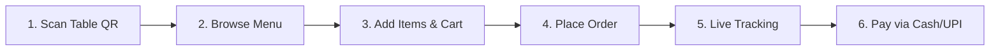

# Nati Nest QR Canteen - Customer User Guide

This user guide describes how customers scan, order, track, and pay for their meals using their mobile devices.

---

## 1. Purpose

The Customer Portal allows diners to access the menu, place orders, request waiter service, and make payments directly from their personal mobile browsers without waiting for staff.

---

## 2. Customer Lifecycle Workflow

---

## 3. Common Tasks

### Scanning the Table QR Code
*   Open your smartphone's camera or QR code scanner.
*   Point it at the QR code sticker fixed to your dining table.
*   Tap the link that appears to launch the Nati Nest app in your mobile browser.

### Browsing the Menu & Adding Items
*   Tap category filters (e.g. *Main Course*, *Drinks*) to navigate.
*   Type in the search bar to locate specific dishes (e.g., *Masala Dosa*).
*   Tap **Add** to add items to your cart.
*   Open the Cart drawer to increase quantities or add custom kitchen notes (e.g., "Make it spicy").

### Placing and Tracking Orders
*   In the Cart drawer, review your items and tap **Place Order**.
*   Verify your order summary and tap **Confirm**.
*   You will be redirected to the **Live Order Tracking** page, displaying preparation status (Placed, accepted, preparing, ready, delivered).

### Requesting the Bill & Tipping
*   Once you're ready to leave, go to the **Bill** page.
*   Review your itemized breakdown and subtotal.
*   Choose a preset tip (₹10, ₹20, ₹50) or input a custom tip amount for the staff.
*   Choose your payment method:
    *   **Cash**: Tap **Pay with Cash** -> **Notify Waiter**. Wait for the server to collect cash.
    *   **UPI**: Tap **Pay Online (UPI)**. Scan the generated QR code using any UPI app (GPay, PhonePe, Paytm). Confirm the payment, then tap **I've Completed Payment**.

---

## 4. Troubleshooting & Best Practices

### The QR code won't scan
*   Ensure there is sufficient lighting and clear camera focus on the code.
*   If scanning fails, request assistance from a waiter.

### Stale Cart or Session
*   If you close your browser tab, your cart and placed orders are preserved as long as you use the same browser and don't clear your browser data.
*   If the page fails to update, refresh your browser.
