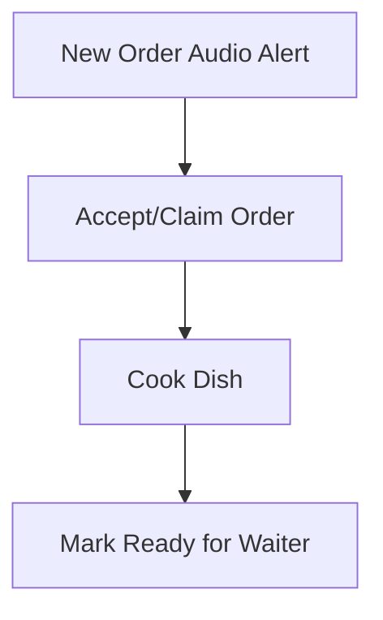

# Nati Nest QR Canteen - Kitchen User Guide

This guide helps kitchen staff (chefs, cooks) manage preparation queues and today's menu availability.

---

## 1. Purpose

The Kitchen Dashboard coordinates incoming food orders, assigns responsibilities to cooks, and notifies waitstaff instantly when items are ready to serve.

---

## 2. Kitchen Daily Workflow

---

## 3. Common Tasks

### Managing Incoming Orders
*   Keep the **Kitchen Board** open on your tablet or wall-mounted display.
*   When a new order is placed, the board plays a loud ding/chime and inserts the order into the **PLACED** column.
*   Tap **Accept** to claim the order. This changes its status to **PREPARING** and locks it under your cook account so other staff don't prepare it.

### Completing Orders
*   Once dishes are cooked, tap **Ready** on the order card.
*   This automatically moves the order to the Waiter Dashboard for delivery.

### Rejecting Orders or Items
*   If an item is out of stock, tap the **Reject** button on the order card.
*   Input the reason for rejection (e.g. "Cabbage out of stock"). The waiter is notified immediately.

### Today's Menu Management
*   Tap the **Daily Menu** modal on your board.
*   You can toggle items:
    *   **Hide Item**: Marks the item out of stock. Customers cannot view or order it for the rest of the day.
    *   **Restore Item**: Re-enables the item for customer ordering.

---

## 4. Troubleshooting & Best Practices

*   **No Sound Alerts**: Verify that your browser tab has permissions to play audio and volume is turned up on the device.
*   **Offline/Disconnected Alert**: If the screen stops updating or shows a red disconnected banner, refresh the browser page to re-establish the Socket.IO connection.
*   **Claim Conflicts**: If two cooks attempt to click "Accept" at the exact same millisecond, the database compare-and-swap mechanism will yield a conflict message to the second cook, preventing double preparation.
