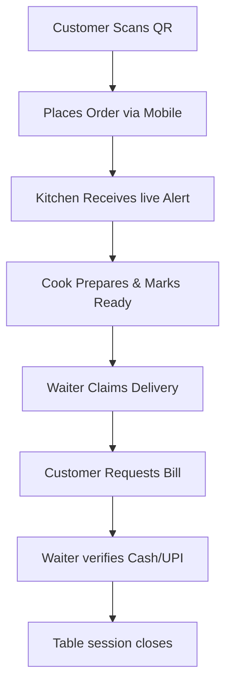

# Nati Nest Smart QR Canteen - Owner's Handbook

This handbook provides a non-technical operational manual for the restaurant owner or general manager, explaining how the Nati Nest Smart QR Canteen Management System operates and how it benefits your business.

---

## 1. Project Overview & Business Benefits

Nati Nest Smart QR Canteen is a digital-first restaurant operations suite designed to optimize customer self-ordering, kitchen throughput, server coordination, and administrative reporting.

### Key Business Benefits
*   **Reduced Labor Cost**: Customers scan QR codes at tables and order directly, reducing the need for waiters to write down orders.
*   **Increased Table Turnover**: Faster ordering, billing requests, and direct digital payments (UPI) speed up the dining lifecycle.
*   **Elimination of Order Errors**: Custom kitchen instructions are captured digitally from the client's screen, minimizing miscommunication.
*   **Real-time Revenue Visibility**: Track sales, payment states, and staff performance in real-time.

---

## 2. Main Business Flow

The dining lifecycle runs through a connected flow across four user interfaces:

### Simple Explanation of the Flows

1.  **Customer Self-Ordering**:
    *   The customer scans the unique QR code on the table using their phone. This automatically establishes a **Table Session** (e.g., Table 5).
    *   They browse the menu, filter categories, select items, add special kitchen instructions, and click **Place Order**.
2.  **Kitchen Processing**:
    *   The kitchen screen flashes and plays a sound alert when new orders arrive.
    *   Staff **Accept** the order (claiming ownership so other cooks know they are preparing it).
    *   When the food is prepared, they mark it **Ready**.
3.  **Delivery & Table Assistance**:
    *   The waiter screen shows orders that are **Ready** for delivery.
    *   A waiter **Claims** the delivery, carries it to the table, and marks it **Delivered**.
    *   Waiters also receive live notifications if a table requests **Water**, **General Assistance**, or the **Bill**.
4.  **Billing & Settlement**:
    *   The customer clicks **Bill** from their phone, adds an optional **Tip** for the staff, and selects **Cash** or **UPI**.
    *   For **UPI**, the system generates a dynamic QR code encoding the exact bill total plus tip.
    *   Once the customer pays, the waiter verifies the payment on their dashboard, closing the table session and freeing the table.

---

## 3. Revenue Tracking & Reports

All sales figures are computed dynamically from orders and verified payments:
*   **Unpaid Bills**: View tables currently in active sessions that have placed orders but have not yet completed payment verification.
*   **Revenue Reports**: Under Admin Reports, view daily, weekly, and custom date range revenue statements.
*   **Tipping Reports**: Monitor tips collected per session to distribute among staff members.
*   **Exports**: Download any report (Revenue, Payments, Tips, Feedback, Catering Leads) to Microsoft Excel or CSV format for accountant reviews.
