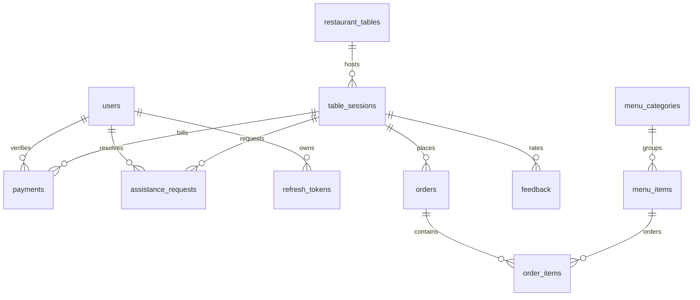
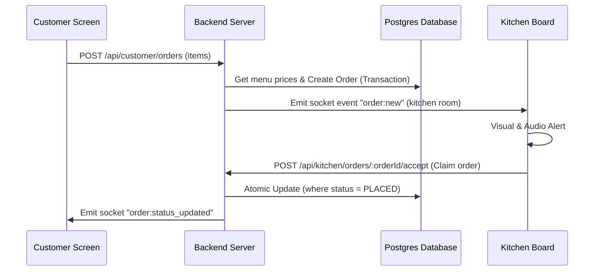

# Nati Nest QR Canteen - System Architecture Document

This document describes the technical architecture, database schemas, and integration structures of the canteen management system.

---

## 1. Technical Stack

*   **Database**: PostgreSQL managed via Prisma ORM.
*   **Backend**: Node.js, Express, TypeScript, Socket.IO.
*   **Frontend**: Next.js 15, App Router, TypeScript, Tailwind CSS, Zustand, Socket.IO Client.

---

## 2. Database Schema (Prisma Models)

The system utilizes PostgreSQL with strict relational models. Below is the entity relationship:



### Critical Models & Indexes
*   **`User`**: Admin, Waiter (`SERVER`), and Kitchen roles.
*   **`TableSession`**: Tracks active dining instances per table. Indexed on `[tableId, status]` for quick live dashboard queries.
*   **`Order` & `OrderItem`**: Captures kitchen orders, unit prices, and prepare states. Indexed on `[sessionId, status]`, `[status, placedAt]`.
*   **`Payment`**: Handles billing calculations. Contains `totalAmount` and `tipAmount` (both `Decimal` types for currency accuracy). Indexed on `[status, verifiedAt]`.
*   **`DailyMenu`**: Represents the active menu items offered today. Indexed on `[menuDate, removedAt]`.

---

## 3. Communication Architecture

### Socket.IO Event Rooms
To isolate messages and notify only the appropriate staff/clients, the system defines explicit communication rooms:
*   `server`: Rooms for waitstaff (`SERVER` role) to receive water requests, bill requests, and payment tip updates.
*   `kitchen`: Room for kitchen cooks to receive incoming food prep orders and cancellation alerts.
*   `session_[sessionId]`: Room for individual table sessions, letting customers receive live updates on their specific orders or payment confirmations.

### Sequence Flow: Order Placement & Processing



---

## 4. Payment Flow & Decimals Safety

All payment totals and tips utilize decimal types to protect against JavaScript floating-point errors.
*   **Base Amount**: Calculated inside the `buildBillSummary` service by summing `unitPrice * quantity` values rounded to 2 decimal places.
*   **UPI payload validation**:
    ```typescript
    const upiLink = `upi://pay?pa=${upiId.trim()}&pn=${encodeURIComponent(businessName.trim())}&am=${amount.toFixed(2)}&cu=INR`;
    ```
    This generates a valid QR code representing the exact order subtotal plus the selected tip amount.
