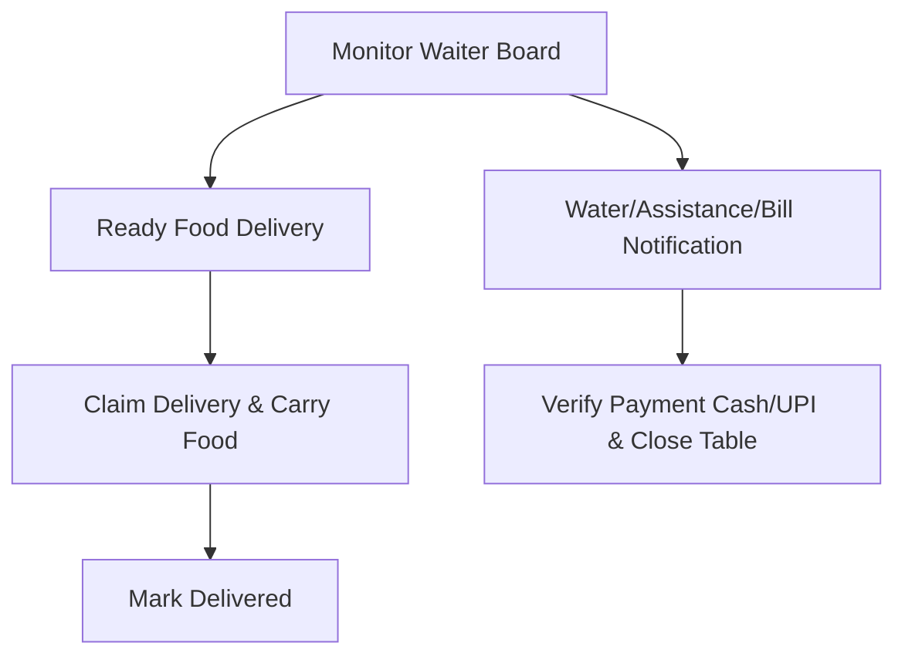

# Nati Nest QR Canteen - Waiter User Guide

This guide details waitstaff duties for handling customer requests, food delivery, and payment verification.

---

## 1. Purpose

The Waiter Dashboard notifies floor staff of customers requesting assistance, shows which orders are ready to deliver from the kitchen, and facilitates payment verification.

---

## 2. Waiter Daily Workflow

---

## 3. Common Tasks

### Handling Customer Assistance Requests
*   Keep the **Waiter Dashboard** open on your phone or tablet.
*   **Water / General Requests**: Alert cards will pop up in the assistance requests panel. Go to the table, fulfill the request, and tap **Resolve** on your dashboard.
*   **Bill Requests**: If a customer requests the bill, they will choose Cash or UPI.

### Food Delivery Workflow
*   When the kitchen completes an order, it appears in your **Ready Orders** column.
*   Tap **Claim Delivery** to indicate you are carrying the food.
*   Serve the food to the table, then tap **Mark Delivered** on the card.

### Verifying Payments & Closing Sessions
*   When a customer pays, go to their table.
*   Tap **Verify Payment** on the billing card:
    *   **Cash**: Confirm you collected the cash and select **Confirm**.
    *   **UPI**: Check the customer's phone or your merchant account to verify the transaction reference, then select **Confirm**.
*   Confirming the payment automatically:
    *   Marks the table session as **CLOSED**.
    *   Frees the table status to **AVAILABLE** for new guests.
    *   Marks all order items as **PAID** in the database.

---

## 4. Best Practices

*   **Prompt Resolutions**: Tap "Resolve" on assistance calls as soon as you serve the table, keeping the dashboard clean.
*   **Ownership Discipline**: Always tap "Claim Delivery" before picking up food from the kitchen window. This prevents other waiters from attempting to deliver the same order.
